<p align="center">
  
</p>

<h1 align="center">Cloudflare DDNS for UniFi OS</h1>

<p align="center"><b>A Cloudflare Worker that lets UniFi devices keep a Cloudflare DNS record pointed at your changing home IP.</b> UniFi OS has no native Cloudflare DDNS provider — this Worker is the bridge.</p>

<p align="center">
  
  
  
  
</p>

> A fork of [willswire/unifi-ddns](https://github.com/willswire/unifi-ddns), maintained by [ry-ops](https://github.com/ry-ops) for personal use. Check the original for community support and updates.

---

## How it works

Your UniFi gateway calls the Worker whenever its WAN IP changes, passing the new IP and hostname with a Cloudflare API token as HTTP basic auth. The Worker then:

1. **Verifies** the API token.
2. **Lists zones** — the token must be scoped to **exactly one** zone (it errors otherwise).
3. **Finds** the matching `A`/`AAAA` record (which must already exist).
4. **Updates** it to the new IP — `A` for IPv4, `AAAA` for IPv6, chosen automatically.

Pass `ip=auto` to use the client's own IP. The token lives only on the Worker; nothing sensitive sits on the UniFi device.

## Three-step setup

<p align="center">
  
</p>

### 1 · Deploy the Worker

[](https://deploy.workers.cloudflare.com/?url=https://github.com/ry-ops/unifi-cloudflare-ddns) — or with Wrangler:

```sh
git clone https://github.com/ry-ops/unifi-cloudflare-ddns.git
cd unifi-cloudflare-ddns
npm i
wrangler login
wrangler deploy
```

Note the resulting `*.workers.dev` route.

### 2 · Create a Cloudflare API token

In the [Cloudflare dashboard](https://dash.cloudflare.com/) → **Profile → API Tokens**, create a token from the **Edit zone DNS** template, scoped to the **one** zone you'll use. Save it securely — it's a **User** API token, not an Account token.

### 3 · Configure UniFi OS

In [UniFi OS](https://unifi.ui.com/) → **Settings → Internet → WAN → Dynamic DNS**, add a new entry:

| Field | Value |
|---|---|
| **Service** | `custom` |
| **Hostname** | `subdomain.example.com` (or `example.com`) |
| **Username** | your Cloudflare account email |
| **Password** | the Cloudflare **User** API token |
| **Server** | `<worker-name>.<subdomain>.workers.dev/update?ip=%i&hostname=%h` |

> Omit `https://` from the **Server** field, and keep the `%i` / `%h` placeholders intact.

## Testing & troubleshooting

- Check the DDNS status in UniFi (**Settings → Internet → WAN**) and confirm the Cloudflare record matches your public IP.
- Watch the Worker logs in **Cloudflare → Workers & Pages → your worker → Logs**.

Common issues: `https://` left in the Server field; token missing **Edit zone DNS**; hostname not matching an existing record; token scoped to more than one zone. More in the [original project's FAQ](https://github.com/willswire/unifi-ddns/blob/main/docs/faq.md) and [discussions](https://github.com/willswire/unifi-ddns/discussions).

## Development

```sh
npm i
npm test          # Vitest
wrangler deploy
```

## License & credits

Same license as the upstream [willswire/unifi-ddns](https://github.com/willswire/unifi-ddns). Original by [willswire](https://github.com/willswire); this fork maintained by [ry-ops](https://github.com/ry-ops).

<!-- org-footer -->
---

<p align="center"><sub>Part of <a href="https://github.com/ry-ops">ry-ops</a> · building the pipes between infrastructure, automation, and observability · built by <a href="https://github.com/ry-ops">ry-ops</a></sub></p>
